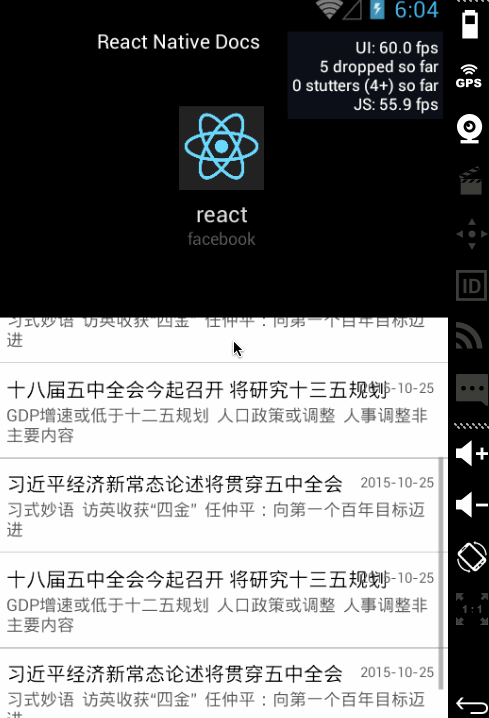

# React Native ReboundScroolView
support android rebound ScrollView, compatible ios -- use react scrollview





## Usage
##Android

In android/setting.gradle

```
...

include ':app',':ReboundScrollView'
project(':ReboundScrollView').projectDir = new File(rootProject.projectDir, '../node_modules/react-native-rebound-scrollview/android/app')

```
In android/app/build.gradle

```
...
dependencies {
    ...
    compile project(':ReboundScrollView')
}
```
Register module (in MainActivity.java)

```
import com.jg.zhang.scrollview.ReboundScrollViewPackage; // <------ add here


public class MainActivity extends Activity implements DefaultHardwareBackBtnHandler {
  ......

  @Override
  protected void onCreate(Bundle savedInstanceState) {
    super.onCreate(savedInstanceState);
    mReactRootView = new ReactRootView(this);

    mReactInstanceManager = ReactInstanceManager.builder()
      .setApplication(getApplication())
      .setBundleAssetName("index.android.bundle")
      .setJSMainModuleName("index.android")
      .addPackage(new MainReactPackage())
      .addPackage(new ReboundScrollViewPackage(this))       // <------ add here
      .setUseDeveloperSupport(BuildConfig.DEBUG)
      .setInitialLifecycleState(LifecycleState.RESUMED)
      .build();

    mReactRootView.startReactApplication(mReactInstanceManager, "ExampleRN", null);

    setContentView(mReactRootView);
  }

  ......

}
```


> 基本功能已现实，还存在BUG，后续完善

### Example

```js
var ArticleDetailView = React.createClass({
	render:function(){
		/*
		HSNetUtils.getDynamicList('getDynamicList',{"aa":11},function(result){
            console.log(result);
        })
		*/
		return(
		<ReboundScrollView>
			<View style={ArticleDetailStyle.container}>
				<View style={ArticleDetailStyle.articleConetent}>
					<Text style={ArticleDetailStyle.articleText}>
						In iOS, the way to display formatted text is by using NSAttributedString: you give the text that you want to display and annotate ranges with some specific formatting. In practice, this is very tedious. For React Native, we decided to use web paradigm for this where you can nest text to achieve the same effect.
					</Text>
				</View>
			</View>
		</ReboundScrollView>
		)
	}
});
```

