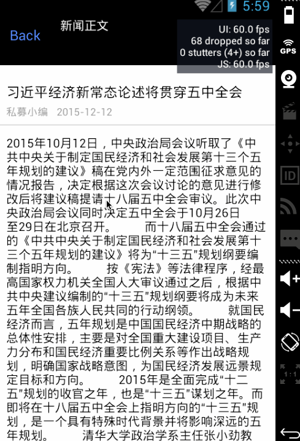

# React Native ReboundScroolView
support android rebound ScrollView, compatible ios -- use react scrollview





## Usage

### Example

```js
var ArticleDetailView = React.createClass({
	render:function(){
		/*
		HSNetUtils.getDynamicList('getDynamicList',{"aa":11},function(result){
            console.log(result);
        })
		*/
		return(
		<ReboundScrollView>
			<View style={ArticleDetailStyle.container}>
				<View style={ArticleDetailStyle.articleConetent}>
					<Text style={ArticleDetailStyle.articleText}>
						In iOS, the way to display formatted text is by using NSAttributedString: you give the text that you want to display and annotate ranges with some specific formatting. In practice, this is very tedious. For React Native, we decided to use web paradigm for this where you can nest text to achieve the same effect.
					</Text>
				</View>
			</View>
		</ReboundScrollView>
		)
	}
});
```

